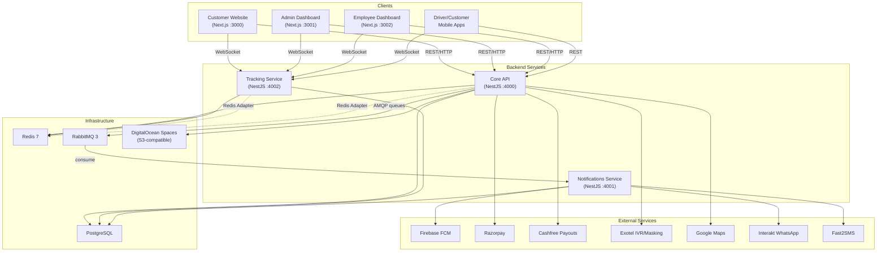

# Taxiby — System Design Document

> **Generated from codebase analysis on 2026-09-21. Everything below is based on what was found in the source code. Assumptions are flagged explicitly.**

---

# 1. System Overview

Taxiby is a **full-stack taxi booking and fleet management platform** built for the Indian market (primarily Coimbatore). It serves three user roles — **Customers** (book rides via website/mobile app), **Drivers** (accept rides via a mobile app), and **Operators** (employees/admins manage bookings, CRM, invoicing, and payouts via web dashboards). The platform handles the full lifecycle: search → pricing → booking → dispatch → real-time tracking → trip completion → invoicing → payment → driver payouts, plus CRM features like leads management, IVR call center integration (Exotel), promotions/coupons, driver subscriptions, customer subscriptions, SOS alerts, and detailed analytics/reporting. The codebase consists of **5 independently deployable units** (3 backend microservices + 2 web dashboards + 1 customer-facing website) communicating via REST, WebSockets, and RabbitMQ, backed by PostgreSQL, Redis, and external services (Razorpay, Cashfree, Exotel, Firebase, AWS S3, Google Maps, Interakt WhatsApp, Fast2SMS).



---

# 2. Tech Stack

| Layer | Technology | Why (inferred from code usage) |
|---|---|---|
| **Backend Framework** | NestJS 11 (TypeScript) | Modular architecture, DI, decorators, built-in WebSocket/scheduling/microservices support |
| **Database** | PostgreSQL (remote server at 192.168.0.26) | Relational data with complex pricing/booking relationships; ACID for financial transactions |
| **ORM** | Prisma 7 | Type-safe queries, schema-as-code, migration management; 2,476-line schema with 60+ models |
| **Caching / PubSub** | Redis 7 (ioredis) | Driver location hashes, OTP storage, session data, WebSocket adapter for multi-instance pub/sub |
| **Message Queue** | RabbitMQ 3 | Decouples notification delivery (push, SMS, WhatsApp, SOS, web-push, reawake) from core API |
| **Job Queue** | BullMQ (Redis-backed) | Background job processing (push notification cleanup, report generation) |
| **Real-time** | Socket.IO (via NestJS WebSockets) | Live driver tracking, call center events, booking dispatch, SOS broadcasts |
| **Auth (Backend)** | JWT (jsonwebtoken) + bcrypt, OTP via SMS/Email, Firebase Auth | Stateless API auth; Firebase for mobile app social/phone login |
| **Auth (Frontends)** | NextAuth v4 | Session management with custom JWT strategy; separate cookie namespaces per app |
| **Frontend Framework** | Next.js 16 (React 19, TypeScript) | SSR/SSG for website SEO pages, app router for dashboards |
| **UI Components** | Radix UI + Tailwind CSS 4 + shadcn/ui pattern | Accessible primitives, consistent design system across admin/employee dashboards |
| **State/Data Fetching** | TanStack React Query + Zustand (website) | Server-state caching & mutations; client-state for booking flow |
| **Maps** | Google Maps API + @react-google-maps/api + Leaflet | Ride estimation, geocoding, live tracking map, zone management (H3 hexagons) |
| **Payments** | Razorpay (customer payments) + Cashfree (driver payouts) | Razorpay for Indian payment collection; Cashfree for bank transfers/UPI payouts |
| **IVR / Call Center** | Exotel (2 accounts: call center + number masking) | Inbound IVR routing, agent management, customer-driver number masking |
| **Push Notifications** | Firebase Cloud Messaging (FCM) + Web Push (VAPID) | Mobile push via FCM; browser push via web-push library |
| **SMS** | Fast2SMS | OTP delivery and transactional SMS for Indian phone numbers |
| **WhatsApp** | Interakt API | WhatsApp template messaging for booking confirmations/reminders |
| **File Storage** | DigitalOcean Spaces (S3-compatible) | Driver documents, vehicle photos, invoice PDFs |
| **PDF Generation** | Puppeteer + pdf-lib | Invoice PDF rendering (Puppeteer for HTML-to-PDF, pdf-lib for manipulation) |
| **Excel/CSV** | ExcelJS + csv-writer | Report exports in XLSX/CSV format |
| **Geo Indexing** | H3 (Uber's hexagonal grid system) | Zone management, driver-to-zone mapping, geospatial queries |
| **Charts** | Recharts | Analytics dashboards for admin/employee panels |
| **Containerization** | Docker + Docker Compose | Multi-service deployment; Chromium bundled in image for Puppeteer |
| **API Docs** | Swagger (via @nestjs/swagger) | Auto-generated OpenAPI documentation at /api endpoint |

---

# 3. Architecture Deep Dive

## 3.1 Core API Service (`apps/core` — port 4000)

**What it does:** The primary business logic service. Handles all REST API endpoints (~62 modules covering everything from auth to bookings to payouts). It is the central hub that all clients talk to.

**Key modules and their responsibilities:**

| Module | Purpose |
|---|---|
| `auth` | JWT-based authentication, OTP flows, Firebase social login, password reset |
| `authorization` | RBAC with a permissions catalog (14,741 bytes), role-permission-guard pattern |
| `bookings` | Full booking lifecycle (DRAFT→CONFIRMED→SEARCHING→ASSIGNED→ONGOING→COMPLETED). 324KB service file — the largest in the codebase |
| `pricing` | Fare calculation engine (43K+ LOC) with tariff configs, slab-based km pricing, peak-hour surges, night surcharges, rental packages |
| `tracking` | In-core driver dispatch logic, cron jobs for stale-driver cleanup |
| `wallet` | Driver wallet with ledger (double-entry style), balance enforcement, locked balances for pending payouts |
| `payouts` | Driver payout requests → risk scoring → approval workflow → Cashfree transfer execution, with polling cron |
| `commission` | Per-ride commission calculation with booking-type + vehicle-type matrix configs |
| `subscription` | Driver subscription plans with daily ride tracking, carryforward days, abuse detection scoring |
| `customer-subscription` | Recurring ride subscriptions for customers (7/10/30/90-day packages) |
| `notification-engine` | Orchestrator that checks master toggles → user preferences → DND rules → dispatches via RabbitMQ |
| `leads` | CRM lead management with round-robin employee assignment, timeline tracking, task management, reminders |
| `ivr` / `exotel` | Exotel IVR webhook handlers, call session management, number masking for privacy |
| `reports` | Configurable report builder with async execution (QUEUED→PROCESSING→COMPLETED) and file export |
| `invoice` | PDF invoice generation (Puppeteer), commission invoices, manual invoices, history tracking |
| `websocket` | Socket.IO gateway for call-center events (agent registration, incoming calls, SOS broadcasts) |
| `sos` | Emergency alert system — customer triggers → WebSocket broadcast → RabbitMQ → web-push to admins |
| `analytics` / `dashboard` | Aggregated metrics, cached dashboard data with DB-level caching (DashboardCache model) |
| `logging` | Structured request-context middleware, centralized system/activity/security logs in DB |

**Communication patterns:**
- **REST** → All CRUD and business operations
- **WebSocket (Socket.IO)** → `/call-center` namespace for real-time call events; uses Redis adapter for horizontal scaling
- **RabbitMQ** → Publishes to 6 queues: `push_notification_queue`, `web_push_queue`, `sos_queue`, `whatsapp_queue`, `sms_queue`, `driver_reawake_queue`
- **Cron jobs** → 9+ scheduled tasks (booking reminders every 5 min, subscription checks every 10 min, payout polling every 5 min, log retention daily, document expiry reminders daily, wallet enforcement daily, lead reminders every minute)

**Design patterns visible in code:**
- **Module pattern** (NestJS modules with clear dependency injection)
- **Service-Controller separation** (controllers are thin, services hold logic)
- **Global exception filters** (HttpExceptionFilter, PrismaClientExceptionFilter)
- **Global response transform** (TransformInterceptor wraps all responses in standard envelope)
- **Request-context middleware** (RequestContextMiddleware injects request ID, trace ID for distributed logging)
- **Event-driven notifications** (publish to RabbitMQ, consume asynchronously)
- **RBAC with permission guard** (PermissionGuard + @RequirePermissions decorator)
- **Maker-checker workflow** (PayoutApproval model for payout request approvals)
- **Ledger pattern** (WalletLedger for driver wallet transactions — debit/credit entries with running balance)
- **Audit trail** (PayoutAuditLog, BookingEditHistory, InvoiceHistory — append-only records)

---

## 3.2 Notifications Service (`apps/notifications` — port 4001)

**What it does:** A standalone NestJS service that consumes messages from RabbitMQ queues and delivers notifications through multiple channels.

**Channels consumed:**

| Queue | Handler | Delivery Channel |
|---|---|---|
| `push_notification_queue` | `consumePushQueue()` | Firebase Cloud Messaging (FCM) |
| `web_push_queue` | `consumeWebPushQueue()` | Web Push (VAPID) |
| `sos_queue` | `consumeSosQueue()` | Web Push to admins + optional webhook |
| `whatsapp_queue` | `consumeWhatsAppQueue()` | Interakt WhatsApp API |
| `sms_queue` | `consumeSmsQueue()` | Fast2SMS API |
| `driver_reawake_queue` | `consumeReawakeQueue()` | Silent push to wake driver app |

**How it communicates:** Subscribes to RabbitMQ using raw `amqplib` (not NestJS microservices transport). Each queue consumer processes messages, calls the appropriate sub-service (FcmService, InteraktService, WebPushService, Fast2SmsService), and updates notification status in the database.

**Design patterns:**
- **Consumer pattern** (OnModuleInit connects to RabbitMQ and begins consuming)
- **Channel adapter pattern** (each delivery channel is its own service)
- **Fire-and-forget** (core service publishes to queue and returns immediately)

---

## 3.3 Tracking Service (`apps/tracking` — port 4002)

**What it does:** Dedicated real-time service for driver GPS location tracking and booking dispatch via WebSockets.

**Key responsibilities:**
- Receives `driver:location` WebSocket events from the driver mobile app
- Stores locations in Redis hashes (key: `driver:{id}`, fields: lat, lng, speed, heading, h3Index, zoneId)
- Persists `DriverLocationSnapshot` records to PostgreSQL every 30 seconds via cron
- Handles `booking:dispatch` to find and notify nearest available drivers
- Emits live location updates to clients subscribed to specific drivers
- Broadcasts notification events to users/admins

**Communication:**
- **WebSocket** (`/tracking` namespace) — bidirectional with Redis adapter for multi-instance
- **PostgreSQL** — snapshots, telemetry, booking updates
- **Redis** — ephemeral driver location store, zone cache

**Design patterns:**
- **Room-based pub/sub** (drivers join `driver:{id}` rooms; clients subscribe to specific driver rooms)
- **Zone cache** (ZoneCacheService caches zone-to-H3 mappings to avoid repeated DB queries)
- **Interval-based persistence** (@Interval every 30s to batch-persist snapshots)

---

## 3.4 Admin Dashboard (`taxiby_admin` — port 3001)

**What it does:** Full-featured management console for super-admins and admins. 31 dashboard route groups covering bookings, drivers, customers, pricing, payouts, leads, IVR, reports, SOS, notifications, roles/permissions, and more.

**Key technical details:**
- Next.js 16 with App Router (route groups: `(auth)` for login, `(dashboard)` for protected pages)
- NextAuth v4 with custom cookie name (`next-auth.session-token-admin`) to prevent session collision with employee dashboard
- TanStack React Query for data fetching/caching
- TanStack React Table for sortable/filterable data grids
- Leaflet + Google Maps for live driver map and zone management
- Recharts for analytics dashboards
- Framer Motion for animations
- Socket.IO client for real-time call center and SOS alerts

---

## 3.5 Employee Dashboard (`taxiby_employee` — port 3002)

**What it does:** Operational dashboard for employees (call center agents, team leaders). Similar to admin but with restricted permissions. Features CRM, booking management, lead assignment, call recording playback (wavesurfer.js), and invoice generation.

**Key differences from admin:**
- Separate NextAuth session with middleware that checks employee token
- More sophisticated middleware (redirects authenticated users from login to dashboard)
- Includes `pdf-lib` for client-side PDF manipulation (invoice editing)
- Audio player for call recording playback (wavesurfer.js, react-h5-audio-player)

---

## 3.6 Customer Website (`taxiby_website` — port 3000)

**What it does:** Public-facing marketing + booking website. Includes SEO-optimized route-specific landing pages (Coimbatore to Ooty, Chennai, Bangalore, etc.), booking flow, customer auth, subscription purchase, saved locations, invoice download, and driver enrollment.

**Key technical details:**
- Heavy SEO focus: `sitemap.ts`, `robots.ts`, 15+ route-specific landing pages
- GSAP + Framer Motion for rich animations, Lottie for animated illustrations
- Embla Carousel for hero sections
- Zustand for booking flow state management (vs. React Query in dashboards)
- Google Places Autocomplete for address input
- Socket.IO for live tracking after booking

---

## 3.7 Database Architecture

**PostgreSQL** with **83KB Prisma schema** containing:
- **60+ models** spanning users, bookings, payments, drivers, vehicles, pricing, subscriptions, notifications, CRM, invoicing, payouts, and comprehensive logging
- **30+ enums** for type-safe status tracking
- **Composite indexes** strategically placed (e.g., `[driverId, status]`, `[createdAt, status]`)
- **Composite primary keys** on log tables (`[createdAt, id]`) — likely designed for time-range partitioning
- **Soft references** (no cascade deletes on core entities; audit data preserved)
- **Financial precision** using `Decimal(12,2)` consistently for all monetary fields

**Key data relationships:**
```
User ──1:1──> Customer / Driver / Employee / Admin
Customer ──1:N──> Booking ──1:N──> Payment
                  Booking ──1:1──> Trip ──1:N──> Rating
                  Booking ──1:N──> BookingEvent (status timeline)
                  Booking ──1:N──> BookingDispatchLog (which drivers were offered)
Driver ──1:1──> Vehicle ──N:1──> VehicleType
Driver ──1:N──> WalletLedger (financial ledger)
Driver ──1:N──> DriverSubscription ──1:N──> SubscriptionDailyLog
BookingType + VehicleType ──> TariffConfig ──> KmPriceSlab, PeakHourRule
CouponCampaign ──> Coupon ──> CouponRedemption
IncentiveCampaign ──> IncentiveRule ──> DriverIncentiveProgress
```

---

# 4. Key Engineering Decisions & Tradeoffs

### Decision 1: NestJS Monorepo with 3 Microservices (not a pure monolith, not full microservices)

**What was chosen:** A NestJS monorepo (`nest-cli.json` with `monorepo: true`) housing 3 apps (core, notifications, tracking) + 1 shared library (database). They share the same `package.json`, Prisma schema, and node_modules but deploy as separate processes.

**Why this instead of the alternative:**
- Avoids the overhead of true microservices (separate repos, independent schemas, API contracts) for a small team
- Lets the tracking and notification services scale independently from the core API
- Shared Prisma client eliminates data-model duplication

**What we gained:** Rapid development velocity with shared types/models; independent deployment of latency-sensitive (tracking) and throughput-sensitive (notifications) services.

**What we gave up:** All services must upgrade Prisma/NestJS together; core service is still a monolith internally (62 modules, 324KB bookings service); no independent database per service means single-DB bottleneck.

---

### Decision 2: PostgreSQL (not MongoDB, not DynamoDB)

**What was chosen:** Single PostgreSQL instance for all data, including time-series data (driver location snapshots, logs).

**Why this instead of the alternative:** The booking/payment/subscription domain is heavily relational with complex joins (booking → customer → user, booking → tariff → slabs). Financial accuracy requires ACID transactions. Prisma ORM has first-class PostgreSQL support.

**What we gained:** ACID compliance for financial transactions (wallet debits, commission calculations, payout processing). Strong schema enforcement via Prisma. Complex query capabilities for analytics/reports.

**What we gave up:** Time-series data (DriverLocationSnapshot, SystemLog, ActivityLog, SecurityLog) in PostgreSQL will grow very fast and degrade query performance. No horizontal scaling — the single DB is a bottleneck. The composite PK `[createdAt, id]` on log tables hints at awareness of this problem but doesn't fully solve it without actual partitioning.

---

### Decision 3: RabbitMQ for Async Messaging (not Redis Streams, not Kafka)

**What was chosen:** RabbitMQ 3 with durable queues for notification delivery.

**Why this instead of the alternative:** RabbitMQ is simpler to operate than Kafka for fan-out-to-multiple-channels pattern. Durable queues ensure notifications survive service restarts. The management UI (port 15672) provides observability.

**What we gained:** Reliable delivery guarantee (durable queues with ack). Clean separation between booking flow (sync) and notification delivery (async). Simple consumer model.

**What we gave up:** Using raw `amqplib` instead of NestJS's built-in microservices transport means no automatic reconnection handling, no dead-letter queue configuration visible in code, no message retry/backoff strategy. RabbitMQ doesn't support event replay (unlike Kafka), so if a consumer fails, messages may be lost.

---

### Decision 4: WebSockets with Redis Adapter (not polling, not Server-Sent Events)

**What was chosen:** Socket.IO WebSockets with `@socket.io/redis-adapter` for both call-center events and live GPS tracking.

**Why this instead of the alternative:** Live driver tracking requires sub-second latency that HTTP polling can't match. The Redis adapter enables multiple tracking/core service instances to share WebSocket state.

**What we gained:** True real-time communication — driver location updates, booking dispatch notifications, SOS alerts, and call-center events are all instant. Redis adapter enables horizontal scaling of WebSocket services.

**What we gave up:** WebSocket connections are stateful and consume server resources. The `origin: '*'` CORS setting on both tracking and core gateways is a security risk. No authentication on WebSocket connections is visible — anyone can connect and subscribe to driver rooms.

---

### Decision 5: Dual Payment Providers — Razorpay (collect) + Cashfree (payout)

**What was chosen:** Razorpay for collecting customer payments; Cashfree for disbursing driver payouts.

**Why this instead of the alternative:** Razorpay is the standard Indian payment gateway for collection but its RazorpayX payout product may have been insufficient. Cashfree Payouts specializes in bulk disbursements with IMPS/NEFT/UPI support.

**What we gained:** Best-of-breed for each flow — Razorpay's payment page for customers, Cashfree's fast bank transfers for drivers. The payout system includes risk scoring, maker-checker approvals, and commission slabs.

**What we gave up:** Two payment provider integrations to maintain, two sets of API keys, two sets of webhook handlers. The PayoutRequest model still has column names like `razorpayContactId` (mapped to `cashfreeBeneficiaryId`), revealing a mid-project migration that left legacy naming.

---

### Decision 6: OTP-based Authentication (not OAuth2/SSO)

**What was chosen:** Phone-based OTP for customer/driver auth (via Fast2SMS), email OTP for admin/employee auth, Firebase Auth for mobile app social login.

**Why this instead of the alternative:** Indian market users (drivers especially) are phone-first. OTP is the standard pattern for ride-hailing apps in India.

**What we gained:** Frictionless auth for mobile users — no password to remember. Firebase handles the social login complexity. Admin/employee dashboards use email OTP for additional security.

**What we gave up:** The JWT tokens are generated with extremely long expiry (`36500d` = 100 years as default fallback in code), effectively making them permanent. OTPs are generated with `Math.random()` which is not cryptographically secure. The JWT secret in `.env` is literally `your-super-secret-jwt-key-change-this-in-production`.

---

### Decision 7: H3 Hexagonal Grid for Geo-Indexing (not PostGIS, not geohash)

**What was chosen:** Uber's H3 hexagonal grid system (`h3-js` library) for zone management and driver-to-zone mapping.

**Why this instead of the alternative:** H3 provides uniform hexagonal cells (unlike rectangular geohashes) which are better for radial distance calculations in ride dispatch. Each zone stores an array of H3 indexes.

**What we gained:** Efficient "which drivers are in this zone" queries. Clean zone boundaries that work well with radial distance. Used across backend (driver tracking, zone cache), admin dashboard (zone management with Leaflet/maps), and website (slot-based booking with H3 coverage checks).

**What we gave up:** Zone data is stored as `String[]` of H3 indexes in PostgreSQL rather than using PostGIS geometry types, so spatial queries must be done in application code rather than at the database level. This limits query performance for complex geospatial operations.

---

### Decision 8: Separate Next.js Apps per Portal (not a single multi-tenant app)

**What was chosen:** Three independent Next.js applications — website (port 3000), admin (port 3001), employee (port 3002) — each with their own `package.json`, NextAuth config, and middleware.

**Why this instead of the alternative:** Different audiences need different auth flows, UI patterns, and deployment cadences. The admin and employee dashboards share similar component libraries but have different permission models.

**What we gained:** Independent deployability — can update the website without affecting the admin panel. Separate cookie namespaces prevent session collision. Each app can be optimized for its use case (website = SEO-heavy, admin = feature-rich, employee = operational).

**What we gave up:** Significant code duplication across the three frontends (Radix UI, TanStack Query, Tailwind setup, API service layer, shared components). No shared component library or monorepo tooling (no Turborepo/Nx) means changes must be replicated manually across projects.

---

# 5. What's Actually Weak / Bad Here (be honest)

### 5.1 CRITICAL: Secrets Committed to Source Control

**What's wrong:** The `.env` file is committed to git with production API keys, database credentials, Firebase service account private key, Razorpay secrets, Cashfree credentials, Exotel tokens, Google Maps API key, VAPID keys, and more. JWT secret is literally `your-super-secret-jwt-key-change-this-in-production`.

**Why it's a problem:** Any repo access = full system compromise. Attackers could drain payment accounts, impersonate the Firebase service, access the database, send messages via WhatsApp/SMS, and more.

**Correct fix:** Immediately rotate ALL exposed secrets. Use environment-specific secret management (e.g., HashiCorp Vault, AWS Secrets Manager, or at minimum Docker secrets). Add `.env` to `.gitignore` and use `.env.example` with placeholders.

---

### 5.2 Security: Wide-Open CORS and Unauthenticated WebSockets

**What's wrong:** Core API has `origin: '*'` CORS. WebSocket gateways accept connections without authentication — any client can join driver rooms and receive location data.

**Why it's a problem:** Cross-site request attacks are possible. Driver locations can be tracked by unauthorized parties. SOS broadcasts are visible to anyone with a WebSocket connection.

**Correct fix:** Restrict CORS to known origins. Add JWT validation in `handleConnection()` for both WebSocket gateways. Verify room subscription permissions.

---

### 5.3 Massive Service Files (God Object Anti-Pattern)

**What's wrong:** `bookings.service.ts` is **324KB** (likely 8,000-10,000+ lines). `auth.service.ts` is **64KB** (2,046 lines). `wallet.service.ts` is **48KB**. `pricing.service.ts` is **44KB**. `tracking.service.ts` is **42KB**. `cashfree-payout.service.ts` is **32KB**.

**Why it's a problem:** These files are nearly impossible to review, test, or refactor safely. They violate the Single Responsibility Principle. New developers will struggle to understand the booking flow. Merge conflicts will be frequent.

**Correct fix:** Break into focused sub-services. For bookings: `BookingCreationService`, `BookingDispatchService`, `BookingCompletionService`, `BookingCancellationService`, `BookingSchedulingService`. Apply the same pattern to pricing, auth, and wallet.

---

### 5.4 Virtually No Test Coverage

**What's wrong:** Only 6 spec files found in the entire backend, and most are scaffolded NestJS defaults (e.g., `app.controller.spec.ts` testing "Hello World"). Two real test files exist: `pricing.engine.spec.ts` and `pricing-terms.util.spec.ts`. Zero tests for bookings, auth, wallet, payouts, subscriptions, or any critical business logic.

**Why it's a problem:** The 324KB bookings service has no tests — any change to fare calculation, dispatch logic, or status transitions could introduce regressions silently. The financial modules (wallet, payouts, commission) are especially risky without tests.

**Correct fix:** Prioritize testing for: (1) pricing engine (fare calculations with edge cases), (2) wallet ledger (balance accuracy), (3) payout processing (risk scoring, commission calculation), (4) booking state machine (status transition validity). Use Jest with Prisma mock client.

---

### 5.5 Tons of Scratch/Debug Files in Root

**What's wrong:** The backend root contains ~40+ scratch/debug/test files: `check-db.js`, `scratch.ts`, `test-cf.js`, `test-cf2.js`, `test-cf3.js`, `test-cf4.js`, `test-cf5.js`, `debug-invoice.js`, `debug-ledger.ts`, `patch_tracking.js`, `delete_orphaned_user.js`, `fix-ifsc.js`, multiple `.sql` migration fragments, etc.

**Why it's a problem:** Pollutes the codebase, confuses developers about what's production code vs. one-off scripts. Some scripts contain hardcoded credentials or direct DB manipulation.

**Correct fix:** Move useful scripts to `scripts/` directory with README. Delete obsolete ones. Use a proper migration strategy instead of ad-hoc `.sql` files.

---

### 5.6 TODO: Password Not Hashed in Customer Creation

**What's wrong:** In `customers.service.ts` line 85: `passwordHash: createCustomerDto.password, // TODO: Implement Hashing`. The password is stored in plaintext.

**Why it's a problem:** Customer passwords are stored unhashed in the database. If the DB is compromised, all customer passwords are exposed.

**Correct fix:** Use `bcrypt.hash()` as already implemented in `auth.service.ts`. This is a one-line fix that's been marked TODO and never addressed.

---

### 5.7 Insecure OTP Generation

**What's wrong:** OTPs are generated with `Math.floor(100000 + Math.random() * 900000)`. `Math.random()` is not cryptographically secure.

**Why it's a problem:** An attacker observing multiple OTPs could predict future values using the PRNG state.

**Correct fix:** Use `crypto.randomInt(100000, 999999)` from Node.js's crypto module (already imported in `main.ts`).

---

### 5.8 Database Connection Pooling Not Configured

**What's wrong:** The DATABASE_URL includes `?connection_limit=25` but there's no connection pooler (PgBouncer) in the deployment. The Prisma adapter uses `@prisma/adapter-pg` (raw `pg` driver) which is a dependency but it's not clear if the pooling adapter is actually used in the DatabaseService.

**Why it's a problem:** Each of the 3 backend services creates its own connection pool to the same PostgreSQL instance. Under load, this could exhaust PostgreSQL's connection limit.

**Correct fix:** Deploy PgBouncer as a connection pooler. Set appropriate pool sizes per service. The commented-out PgBouncer Supabase URL in `.env` suggests this was considered but not implemented locally.

---

### 5.9 No Rate Limiting

**What's wrong:** No rate limiting middleware is visible anywhere in the codebase. The auth endpoints (OTP generation, login attempts) have no throttling.

**Why it's a problem:** Brute-force OTP attacks, credential stuffing, and API abuse are all possible. The SMS/WhatsApp APIs (Fast2SMS, Interakt) cost money per message.

**Correct fix:** Add `@nestjs/throttler` with appropriate limits per endpoint category (stricter for auth, moderate for API).

---

### 5.10 Single Point of Failure Database

**What's wrong:** All three services connect to the same PostgreSQL instance at `192.168.0.26:5453`. No replication, failover, or backup strategy is visible in the codebase.

**Why it's a problem:** A single database failure takes down the entire platform.

**Correct fix:** Set up PostgreSQL streaming replication with automatic failover (Patroni or cloud-managed PostgreSQL). Implement regular backups. The log tables with composite PKs are ready for time-based partitioning.

---

# 6. Improvements Made / Roadmap

## Evidence of Iteration

Based on the codebase artifacts, the system has evolved through several phases:

1. **Supabase to Self-hosted PostgreSQL:** Commented-out Supabase URLs in `.env` indicate an early cloud DB that was replaced with a self-hosted instance (likely for cost or control).
2. **RazorpayX to Cashfree Payouts:** Column names `razorpayContactId`, `razorpayFundAccountId`, `razorpayPayoutId` mapped via `@map()` to Cashfree column names reveal a payment provider migration.
3. **Monolith to Microservices extraction:** The comment `// Tracking moved to apps/tracking (port 4002)` in `app.module.ts` shows tracking was extracted from the core service.
4. **Schema evolution:** `schema.prisma.bak` (51KB) vs current `schema.prisma` (83KB) shows significant growth — 30KB+ of new models/fields added.
5. **Notification engine overhaul:** Both `notifications` module (in core) and a separate `notification-engine` module exist, suggesting the notification system was redesigned with the orchestrator pattern.
6. **Logging system buildout:** Separate SystemLog, ActivityLog, and SecurityLog tables with request-context middleware were added for observability.

## Proposed Improvement Roadmap

### Quick Wins (1-2 weeks each)
1. **Rotate all secrets** and add proper secret management
2. **Fix plaintext password storage** in customer creation
3. **Add rate limiting** with `@nestjs/throttler`
4. **Secure WebSocket connections** with JWT validation
5. **Restrict CORS** to actual frontend domains
6. **Clean up scratch files** from backend root
7. **Fix OTP generation** to use crypto-secure random

### Medium-term (1-2 months)
8. **Break up god services** — split `bookings.service.ts` into 5-6 focused services
9. **Add core test suite** — pricing engine, wallet ledger, booking state machine
10. **Set up CI/CD pipeline** with automated testing and linting
11. **Implement database partitioning** for log tables
12. **Add PgBouncer** for connection pooling

### Long-term (3-6 months)
13. **Create shared component library** for admin/employee frontends (Turborepo/Nx)
14. **Implement proper dead-letter queues** and retry strategies in RabbitMQ
15. **Add APM/monitoring** (Prometheus + Grafana or DataDog)
16. **Migrate time-series data** (location snapshots) to TimescaleDB or ClickHouse
17. **Implement API versioning** for backward compatibility
18. **Add end-to-end tests** for critical flows (booking to tracking to completion to payout)

---

# 7. Resume Bullet Points

1. **Architected** a multi-service taxi booking platform using NestJS, PostgreSQL, Redis, and RabbitMQ, processing ride bookings across 60+ database models with real-time dispatch and tracking for drivers and customers.

2. **Designed and implemented** a real-time GPS tracking service using Socket.IO with Redis pub/sub adapter, supporting live driver location broadcasting at sub-second latency with horizontal scaling capability.

3. **Built** a configurable fare calculation engine supporting 5+ booking types (outstation, rental, airport, drop, hourly) with slab-based km pricing, peak-hour surges, night surcharges, and coupon/discount application — handling tariff configurations across vehicle types and route categories.

4. **Engineered** a driver payout system with risk scoring, maker-checker approval workflows, and Cashfree bank transfer integration (IMPS/NEFT/UPI), processing automated payouts with commission slab calculation and idempotency guarantees.

5. **Developed** a driver wallet and ledger system using double-entry accounting patterns with locked balance support for pending payouts, daily cron-based enforcement, and 12+ transaction types.

6. **Implemented** a multi-channel notification orchestrator dispatching across FCM push, web push (VAPID), WhatsApp (Interakt), and SMS (Fast2SMS) via 6 RabbitMQ queues, with master toggles, per-user preference controls, and DND scheduling.

7. **Built** 3 Next.js 16 web applications (customer website, admin dashboard, employee CRM) with server-side rendering, TanStack React Query, Radix UI component system, and NextAuth session management with isolated cookie namespaces.

8. **Integrated** Exotel IVR for a call center system with agent routing, call recording, number masking (customer-driver privacy), and real-time WebSocket-based call status updates for the employee dashboard.

9. **Designed** a CRM/leads management system with automated round-robin employee assignment, lead lifecycle tracking, task management, reminder scheduling, and timeline audit trails — converting search history into actionable sales leads. *(estimate — verify conversion rates)*

10. **Implemented** RBAC authorization with a 200+ permission catalog, role-permission-guard pattern, and per-module access control across admin, employee, and super-admin roles for 31 dashboard modules.

---

# 8. Interview Prep — Q&A

### Q1: Can you walk me through how a ride booking works in your system, from search to completion?

**A:** When a customer searches, the website/app hits the pricing engine which loads the tariff config for the selected booking type + vehicle type, calculates the fare using base fare + distance slabs + time component + surge rules, and returns an estimate. On confirmation, a Booking record is created in DRAFT status, then transitions to CONFIRMED → SEARCHING. The tracking service's dispatch logic finds nearby online drivers (using H3 indexes and Redis-stored locations within a configurable search radius), sends dispatch notifications via WebSocket, and tracks accept/reject/timeout responses in BookingDispatchLog. When a driver accepts, status moves to DRIVER_ASSIGNED → DRIVER_ARRIVED (OTP verified) → ONGOING. On trip completion, the system calculates the final fare, creates a Trip record, deducts commission, updates the driver's wallet ledger, generates an invoice, and sends completion notifications via RabbitMQ to the notifications service.

### Q2: Why did you choose NestJS over Express or Fastify?

**A:** NestJS was chosen for its opinionated modular architecture — with 62+ modules, dependency injection is essential for managing service dependencies. The built-in support for WebSockets, scheduled tasks (@Cron), microservices patterns, Swagger generation, and validation pipes reduced boilerplate significantly. Express is too unopinionated for this scale, and while Fastify is faster for raw throughput, the developer productivity gains from NestJS's decorator-based patterns were more valuable for our feature velocity.

### Q3: Why did you switch from RazorpayX to Cashfree for payouts?

**A:** The column mapping in the PayoutRequest model (`@map("razorpayContactId")`) reveals the migration. While Razorpay is excellent for payment collection, Cashfree Payouts offered better APIs for bank transfer disbursements, more flexible beneficiary management, and better support for IMPS/NEFT/UPI payout modes. The dual-provider approach gives us best-of-breed for each direction of money flow, though it adds integration maintenance cost.

### Q4: How does your real-time tracking system scale?

**A:** The tracking service uses Socket.IO with a Redis adapter, which means multiple tracking service instances share WebSocket state through Redis pub/sub. When a driver emits a location update, it's stored in a Redis hash (not the DB) for instant reads. A cron job batch-persists snapshots every 30 seconds. Clients subscribe to specific driver rooms, so location broadcasts are scoped — we don't broadcast every driver's location to every client. The H3 zone cache reduces database queries for zone lookups. However, I'd acknowledge that our current single PostgreSQL instance is a scaling bottleneck, and for true scale we'd need to separate the location time-series data into something like TimescaleDB.

### Q5: Why did you use RabbitMQ instead of processing notifications synchronously?

**A:** Notification delivery is inherently unreliable — Firebase might be slow, WhatsApp API might timeout, SMS provider might rate-limit us. If we processed notifications synchronously in the booking flow, a slow FCM call would delay the booking response. By publishing to RabbitMQ queues, the booking response returns immediately (sub-100ms) while notifications are processed asynchronously with retry capability. It also lets us scale the notifications service independently based on queue depth.

### Q6: Explain your pricing engine design.

**A:** The pricing engine is a layered calculation. First, we load the TariffConfig (matched by booking type + vehicle type). Then we apply: (1) base fare, (2) per-km rate with slab-based reductions (KmPriceSlab — rate drops after certain km thresholds), (3) per-minute rate for duration, (4) night surcharge (time-based), (5) peak-hour surge rules (PeakHourRule — configurable by day-of-week and time range), (6) waiting charges (with free waiting minutes), (7) stops charges, and (8) coupon/discount application. For rental bookings, we use package-based pricing (hours + km included, with extra per-km/per-minute rates). The engine outputs a fare snapshot that's stored with the booking for audit purposes.

### Q7: How do you handle driver wallet and commission?

**A:** The wallet uses a ledger pattern — every financial transaction (ride earning, commission deduction, subscription purchase, payout, incentive earning) creates a WalletLedger entry with the transaction amount and resulting balance. We enforce a unique constraint on `[driverId, referenceId, transactionType]` to prevent duplicate entries. Commission is calculated per-ride based on a CommissionConfig matrix (booking type x vehicle type), with GST computed separately. For payouts, we have a locked balance mechanism — when a payout is requested, the amount is locked (PAYOUT_LOCKED transaction), and only released (PAYOUT_UNLOCKED) if the payout fails. A daily cron enforces minimum balance rules.

### Q8: What security measures are in place, and what would you improve?

**A:** Current measures include JWT authentication, bcrypt password hashing, request-context-based structured security logging, RBAC with a 200+ permission catalog, raw body preservation for webhook signature verification (Razorpay/Cashfree/Exotel), and customer-driver number masking via Exotel. However, I'd be honest about gaps: CORS is too permissive (`origin: '*'`), WebSocket connections lack authentication, OTP generation uses `Math.random()` instead of crypto-secure random, and rate limiting is absent. If I were to improve, I'd add `@nestjs/throttler`, authenticate WebSocket handshakes, tighten CORS, implement IP-based anomaly detection on the auth endpoints, and add request signing for API-to-API calls.

### Q9: Why separate Next.js apps instead of a single app with role-based routing?

**A:** Three separate apps was chosen for deployment independence and security isolation. The customer website is public-facing with SEO requirements (SSG, sitemaps, robots.txt) — very different from the admin dashboard which is a pure SPA behind auth. Separate apps mean a vulnerability in the website doesn't expose the admin panel. They also have different deployment cadences — we can ship website changes multiple times per day without risking the admin panel. The tradeoff is code duplication in shared components, which we'd mitigate with a shared component library if I were to redo it.

### Q10: What would you do differently if you started over?

**A:** Three things: (1) **Monorepo tooling** — I'd use Turborepo or Nx from day one to share components/types across the three frontends and enforce consistent dependencies. (2) **Break the bookings service early** — the 324KB service file accumulated because all booking logic went into one place. I'd design it as a state machine with separate handlers per transition from the start. (3) **Test-driven for financial modules** — the wallet, pricing, and payout modules should have been built test-first given they handle money. A bug in commission calculation silently over/under-charges drivers.

### Q11: How does the lead management / CRM system work?

**A:** Every customer search creates a SearchHistory record. If it doesn't convert to a booking, it automatically becomes a lead (status: LEAD). A cron job running every minute checks for unassigned leads and auto-assigns them to employees using round-robin (tracked via LeadAssignmentConfig.lastAssignedEmployeeId). Employees can then move leads through a pipeline: LEAD → CONTACTED → CONVERTED (creates a booking) or NOT_CONVERTED. Each status change creates a LeadTimeline entry. Employees can create tasks (LeadTask) and reminders (LeadReminder) on leads. This turned abandoned searches into a sales pipeline.

### Q12: Describe your notification architecture.

**A:** It's a three-layer system: (1) **NotificationOrchestratorService** in core decides *what* to send — it checks master toggles (NotificationConfig per platform/event), user preferences (NotificationPreference including muted categories and DND schedule), resolves device tokens, and creates a persistent Notification record. (2) It publishes to the appropriate RabbitMQ queue(s). (3) The **NotificationsService** in the notifications microservice consumes from 6 queues and delivers via the appropriate channel service (FcmService, WebPushService, InteraktService, Fast2SmsService). Real-time socket events are emitted in parallel for instant in-app updates.

### Q13: How do you handle the driver subscription model with carryforward days?

**A:** Drivers purchase subscription plans (e.g., 30-day plan). Each day, a SubscriptionDailyLog records their ride performance against `dailyExpectedRides`. If they meet the target (e.g., 5 rides/day), they earn a carryforward day — the subscription extends by one day. If they miss the target, a commission on the shortfall may apply (`commissionOnShortfallPct`). The system also has abuse detection — the `abuseScore` field flags drivers who accept rides and immediately cancel to game the metrics. A 10-minute cron job processes these logs and handles carryforward/commission calculations.

### Q14: What monitoring/observability do you have?

**A:** The codebase has three structured log tables: **SystemLog** (HTTP request/response logging with response time, status codes, error stacks), **ActivityLog** (business-level audit trail with old/new data diffs and entity references), and **SecurityLog** (auth events, risk scoring, session tracking). All share request IDs and correlation IDs via the RequestContextMiddleware for distributed tracing. A daily cron (`EVERY_DAY_AT_2AM`) handles log retention/cleanup. However, there's no external APM tool (no Prometheus metrics, no Grafana, no error tracking like Sentry). The observability is DB-only, which means monitoring itself adds load to the database.

### Q15: How would you scale this to 10x the current load?

**A:** (1) **Read replicas** for PostgreSQL with query routing — analytics/reports on replica. (2) **Partition log tables** by month using the existing composite PK `[createdAt, id]`. (3) **Move location data** to TimescaleDB or Redis Streams (stop writing every snapshot to PostgreSQL). (4) **Add connection pooling** (PgBouncer). (5) **Scale tracking service horizontally** — the Redis adapter already supports this. (6) **Add CDN** for the Next.js apps. (7) **Implement caching** for tariff configs and zone data (currently read from DB on every pricing call). (8) **Switch to Kafka** for notification delivery if throughput exceeds RabbitMQ's capacity. (9) **Add auto-scaling** with Kubernetes — the Docker setup is ready for this.

---

# 9. Open Questions For Me

1. **What's the actual traffic scale?** How many bookings/day? How many concurrent drivers online? How many WebSocket connections at peak?

2. **Is there a mobile app codebase?** (React Native / Flutter / native?) — the driver/customer mobile apps consume these APIs but their code isn't in this repo.

3. **What's the team size?** How many developers work on this? This affects whether the monorepo-without-tooling approach is a conscious tradeoff or an oversight.

4. **What's the deployment environment?** The `.env` references `192.168.0.26` (local network). Is this running on-premise, on a VPS, or in cloud? Is there a staging environment separate from UAT?

5. **Have the exposed secrets been rotated?** Given the `.env` is committed with production credentials, have these been changed since the last public exposure?

6. **What's the business model?** Commission per ride? Driver subscription fees? Customer subscription revenue? This affects which financial modules are most critical to get right.

7. **Are there any SLAs or uptime requirements?** This would determine the urgency of the single-point-of-failure database issue.

8. **What incidents/outages have occurred?** The numerous debug scripts (`check-db.js`, `debug-invoice.js`, `debug-ledger.ts`) suggest firefighting. Understanding past incidents would help prioritize the roadmap.

9. **What's the Postman collection coverage?** There's a `Taxiby_Driver_APIs.postman_collection.json` — is there equivalent coverage for customer and admin APIs?

10. **Is the IVR system actively used?** The Exotel integration is sophisticated but the webhook secret is `your_webhook_secret` — is this actually deployed?

11. **What's the Google Maps API monthly cost?** There's a 33KB `GOOGLE_MAPS_COST_OPTIMIZATION.md` doc suggesting this is a concern. What optimizations were implemented?

12. **Is there a customer-facing mobile app or just the website?** The `BookingSource` enum includes `APP` but no mobile code is in this repo.
